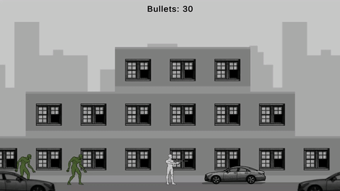

# 2D Platformer

This project was developed as part of a test assignment. The graphical assets were provided with the assignment.




## Installation

#### Requirements:

- Unity 2022.3+
- Input System
- TextMeshPro

#### Install project:

1. Clone this repository:
   ```bash
   git clone https://github.com/WiLLLLL683/Test_2dPlatformer.git
   ```
2. Open `Assets/Scenes/Gameplay.unity` scene in the Unity Editor.
3. Press the Play button to start the game.


## How to play

#### Install game (PC)

1. Download the [Build.rar](https://github.com/WiLLLLL683/Test_2dPlatformer/releases/latest/download/Build.rar) 
file from latest release.
2. Unpack archive.
3. Run the game with `Test_2dPlatformer.exe`.
4. Controls: 
	- WASD for movement
	- LMB tap for single fire
	- LMB hold for burst fire


## Project structure

The entire project is contained within a single scene. The game starts when the scene is loaded and restarts if the scene is reloaded.


### Infrastructure

**Entry Point:**
The entry point is the `Bootstrap` object on `Gameplay` scene. It gathers all dependencies from the scene, creates and runs the `StateMachine` during its `Awake`.

**Dependency Injection:**
Dependency injection is manually handled in the project. A DI framework can be easily integrated if needed (all dependencies are passed through constructors or the `Init()` method).

**State Management:**
The game's state is managed by a simple `StateMachine` without dedicated transition objects. State transitions are handled by calling the generic method `EnterState<TState>()`. There are two states: gameplay and game over.

**Factories:**
Spawners (factories) are used to create game entities. This is an implementation of the Factory Method pattern, with the method extracted into a separate C# class.


### Input

Input handling is based on Unity's `Input System`. A generated C# class with button configurations is processed in the `Input` service. Input service invokes public input events and all interested classes subscribe to these events.


### Game Entities

Game entities are implemented using the Actor-Component architecture:
- **Actors**: Actors aggregate and coordinate the work of components.
- **Components**: Components perform specific logic (e.g., attack, movement, target acquisition).

To enable the combination of various components within the Unity editor, they inherit from an abstract `MonoBehavior` class of their respective type (e.g., `AttackBase`, `MovementBase`). The actor is not tied to specific implementations of its components.


### Configuration

#### Entity Configuration

Game entity settings are configured within prefabs. Components store all necessary parameters and display them in the editor.

#### Items

Droppable items can exist in two different forms:
- As saved data (`ItemData`), for example, inside an inventory component.
- As an `Item` actor that can be picked up.

These are linked via an ID (`string`) and configured in a `scriptable object` (`ItemConfig`). They are then placed in an `ItemSetConfig` and can be retrieved by ID.

#### Gameplay Rules and Spawn Configuration

General gameplay rules and spawn settings are also placed in separate `scriptable objects`. All of them are collected in the `Bootstrap` object.


### Sound and Animations

The logic for sound and visuals effects is separated into individual `MonoBehavior` components. These components subscribe to actor or other component events (`OnMove`, `OnDie`, `OnShoot`) for their operation. This separation allows for independent iteration on game logic and presentation logic.


### UI

A simplified MVP (Model-View-Presenter) pattern is used for the visual interface:
- **View Layer**: Unity canvas.
- **Presenter Layer**: `MonoBehavior` scripts with presentation logic (`GameOverUI` and `HudUI`).
- **Model**: The rest of the game.


## Contact
For any questions please contact: tulohonov_aleks@mail.ru
